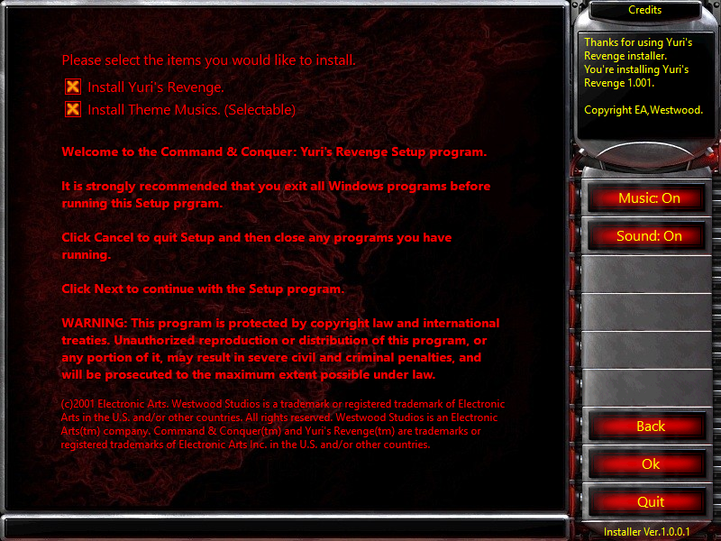
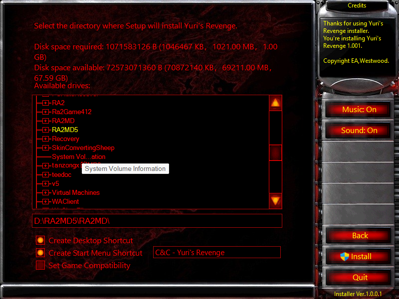
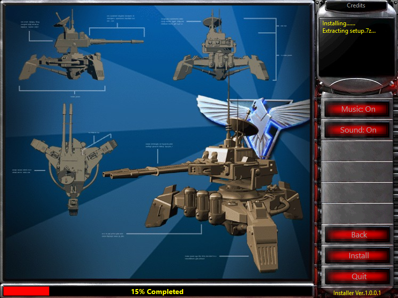
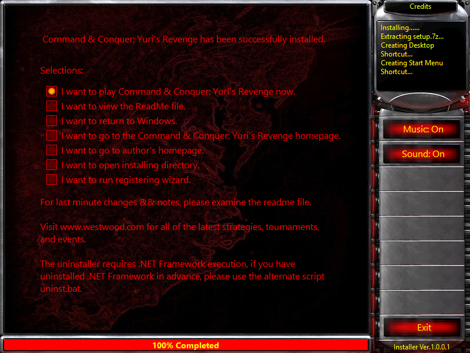

# Installer for YR/RA2 or mods 尤复安装器

> [!IMPORTANT]
>
> This project is the global version of `net-yuri-installer`. It is specifically designed for regions outside of China. Certain features still under testing in the China region will not be included in this version.  
> &emsp;&emsp;本项目是net-yuri-installer的全球版本。专门针对非中国区打造。部分中国区仍在测试的功能将不会加入进此版本。中国版本的安装会判断文件夹是否为空，就像安装完整游戏一样，国际版改为判断是否存在gamemd.exe来安装mod。

This installer project is compatible with most YRMODs (and of course, any other type of program as well). It was inspired by Westwood’s official CD installer.  
&emsp;&emsp;本安装器项目适用于绝大多数YRMOD（当然也包括其他任意类型的程序），灵感来源于[Westwood官方的CD安装包](https://www.uc129.com/xiazai/ra2/10802.html)。 

## Differences from the Chinese version

In Chinese gaming communities, it is common practice to distribute the base game together with the MOD. However, this is not permitted outside of China. Therefore, this version only includes the functionality to install MODs into the game. Note: There is no uninstall feature. Please make a backup of your game copy or implement your own uninstall solution.   
The Chinese version of the installer checks whether the folder is empty, similar to installing the full game. The international version, however, checks for the presence of `gamemd.exe` to determine where to install the MOD.

## Note / 使用注意

Due to time constraints, the comments in the code have not been fully translated into English. Thank you for your patience.

By default, the program reads `setup.7z` (for the mod) and `setup1.7z` (for expansions) as installation files. To modify this behavior, please check ExtraControls.cs and the post-build command line. The post-build command line copies the installation files from the project folder to the output folder.    
&emsp;&emsp;程序默认读取setup.7z（用于MOD）和setup1.7z（用于扩展包）作为安装文件，如果要修改请到ExtraControls.cs和生成后命令行。生成后命令行会将安装文件从项目文件夹复制到生成文件夹去。

## Contents / 目录
1. **Installer (C#)**
   1. Components
      * Source code
      * Extended controls
      * NuGet packages
2. **Packer (Python)**
   1. Components
      * Source code
      * Executable description file
   2. Additional modules (import)
      * pypiwin32
      * pywin32
      * pyinstaller
   3. Notes
      * Dynamically links the installation files with the installer, bundles them into a single `.exe`, and extracts them to a temporary directory at runtime.
3. **Installation Files (7z)**
   1. Notes
      * Usually named `setup*.7z`, though the name does not matter. When using multiple options, overlapping files will be counted repeatedly (to ensure sufficient space).
4. **Packaging Script (Bat)**
   1. Notes
      * Calls the Python packer to bundle the installer and installation files. The generated `.exe` will extract the installation files to a temporary directory when executed.

Once the solution is built, simply click `pack.bat` in the root directory of the solution to package the installer together with the installation files.

1. 安装器（C#）
    1) 组成
        + 源代码
        + 扩展控件
        + NuGet包
2. 打包器（Python）
    1) 组成
        + 源代码
        + 可执行文件描述文件
    2) 额外模块（import）
        + pypiwin32
        + pywin32
        + pyinstaller
    3) 说明
        + 动态链接安装文件和安装器，打包在一个exe里，运行时释放到临时目录。
3. 安装文件（7z）
    1) 说明
        + 一般命名为`setup*.7z`，取什么名字无所谓。使用多选项时若有覆盖的文件将会重复计算（以确保足够空间）。
4. 打包脚本（Bat）
    1) 说明
        + 引用Python打包器打包安装器和安装文件，生成的exe运行时将安装文件释放到临时目录。

&emsp;&emsp;生成完解决方案点击方案根目录的pack.bat即可将安装器与安装文件打包。

## Plan & Features / 功能及计划

Known Bugs / 已知问题:

- On first launch, clicking the "Next" button may occasionally skip the license agreement and go directly to the installation options screen. 初次启动点击前进键偶尔会直接跳过许可协议进入安装选项界面。

What will I do and what did I do / 功能计划:

- [x] Multi-language / 多语言基本支持
- [ ] Use CodeAnalysis / 利用CodeAnalysis检查代码
- [x] A Interface / 安装程序界面
- [ ] Online install / 在线安装
- [x] Can set background window / 安装包背景窗口
- [x] Change Resolution in Program like RA2/YR / 安装包切换分辨率（未来可能弃用）

For Packer / 打包器:

- [ ] Static linking / 静态链接，以免资源浪费

## How to pack / 简易生成步骤

Before proceeding, please make sure you have installed all the required Python dependencies.

1. Build the solution.
2. Run `pack.bat`.
3. Open the Compiled folder to find the generated files.

在此之前请确保你已安装Python所需的所有依赖项。

1. 点击生成解决方案。  
2. 点击pack.bat。  
3. 打开Compiled文件夹，得到生成的文件。  

## Other

* This project is developed using **Visual Studio 2022**.
* Project resources are placed in the `Resources` folder, and installation files are located in the project root directory.
* Installation options (e.g., which files to install) are configured in `ExtraControls.cs`.
* **Do not use this project for any illegal activities!**
* For commercial use of this repository’s code, **do not include any content you do not own the copyright to** (e.g., images, sounds, etc.)!

## Requirements

* [.NET Framework 4.8 Runtime](https://dotnet.microsoft.com/zh-cn/download/dotnet-framework/thank-you/net48-web-installer)

## Copyright

The copyright of the code in this project belongs to Enderseven Tina (Shimada Mizuki, Ender7 Tina, Enderseven1). Any included media sample files are owned by Electronic Arts and Westwood Studios.

&emsp;&emsp;本项目代码著作权属Enderseven Tina（Shimada Mizuki、Ender7 Tina、Enderseven1），所附媒体示例文件归美国艺电公司与西木工作室所有。

## Our Team

+ Author：Flactine
+ Coder：Shimada Mizuki

If you wish to sponsor this project, please don’t forget to also support the project’s author, *Flactine*.

&emsp;&emsp;如果你要赞助本项目，请不要忘记本项目的发起者*Flactine*的那份。

## Screenshots

## Credits

Thanks to 3F:
+ [7zip.Libs](https://github.com/3F/7z.Libs)

Thanks to Joel Ahlgren, Markovtsev Vadim, Jérémy Ansel: 
+ [SharpSevenZip](https://github.com/JeremyAnsel/SharpSevenZip)

Thanks to Mark Heath & Contributors:
+ [NAudio](https://github.com/naudio/NAudio)
+ NAudio.Asio
+ NAudio.Core
+ NAudio.Midi
+ NAudio.Wasapi
+ NAudio.WinForms

Thanks to Alexandre Mutel:
+ [SharpDX](http://sharpdx.org)
+ SharpDX.Direct3D9

Thanks to [Microsoft](https://www.microsoft.com):
+ Microsoft.Bcl.Asynclnterfaces
+ System.Buffers
+ System.IO.Pipelines
+ System.Memory
+ System.Numerics.Vectors
+ System.Runtime.CompilerServices.Unsafe
+ System.Text.Encodings.Web
+ System.Text.Json
+ System.Threading.Tasks.Extensions
+ System.ValueTuple
+ Microsoft.CodeAnalysis.Analyzers
+ System.Collections.Immutable
+ System.Reflection.Metadata
+ System.Text.Encoding.CodePages
+ Microsoft.CodeAnalysis.Common
+ Microsoft.CodeAnalysis.Csharp
+ Microsoft.Win32.Registry
+ System.Security.AccessControl
+ System.Security.Principal.Windows
